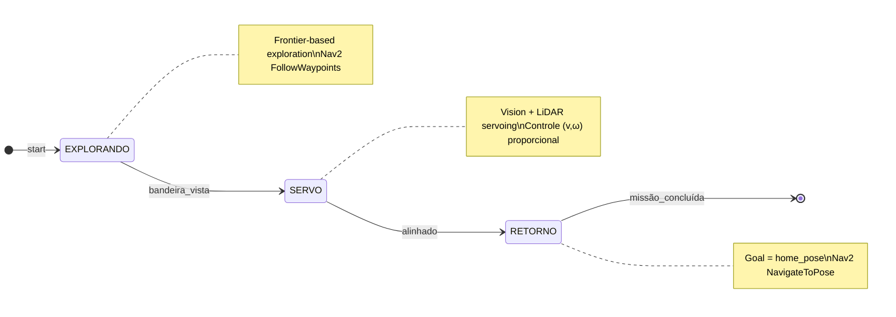

<!-- ===================================================================== -->
<!--                       README – Mission-ROS 2 🤖                         -->
<!-- ===================================================================== -->
# Sistema de Navegação & Controle da Missão com ROS 2 🤖

Projeto para o **Trabalho Avaliado 1 – Robôs Móveis**: um robô autônomo que explora o
ambiente, detecta uma bandeira e se posiciona para capturá-la, usando **ROS 2 Humble**.

<p align="center">
  
</p>

<div align="center">

[](https://www.ros.org/)
[](#como-compilar-e-rodar-)
[](LICENSE)

</div>

---
<div align="center">

• [Estrutura](#estrutura-do-repositório-📂)
• [Visão Geral](#visão-geral-🗺️)
• [Estratégia](#estratégia-adotada🎯)
• [Pacotes ROS 2](#pacotes-ros-2-utilizados)
• [Arquitetura & Algoritmos](#arquitetura--algoritmos-⚙️)
• [Resultados](#resultados-📊)
• [Compilar e Rodar](#como-compilar-e-rodar-🚀)
• [Contribuição](#contribuição-🤝)
• [Licença](#licença-📄)
• [Membros](#membros-👥)

</div>

---

## Estrutura do repositório 📂

```bash
mission-ros2/
├── launch/                # Arquivos .launch.py
├── params/                # YAML de parâmetros
├── scripts/
│   ├── mission_manager.py # Máquina de estados global
│   └── flag_servo.py      # Servo-visão/LiDAR
├── urdf/                  # Modelo Xacro do robô
├── meshes/                # Recursos 3D
├── assets/                # GIFs & imagens usadas no README
├── package.xml
├── setup.py
└── README.md
```

---

## Visão geral 🗺️

| Componente (pasta/arquivo) | Tipo | Responsabilidade principal | Tópicos / recursos ROS 2 usados |
|-----------------------------|------|----------------------------|---------------------------------|
| **`scripts/mission_manager.py`** | Nó Python | Máquina de estados global (Explorar → Servo → Retorno). Gera metas ao Nav2, escuta `/flag_servo_arrived`, salva pose inicial. | `nav2_msgs/action/FollowWaypoints`, `geometry_msgs/PoseStamped`, `tf2_ros`, `/map`, `/odom` |
| **`scripts/flag_servo.py`** | Nó Python | Servo-visão + LiDAR: alinha e aproxima-se da bandeira, publica conclusão. | `/camera/image_raw`, `sensor_msgs/LaserScan`, `/cmd_vel`, `/flag_servo_enable`, `/flag_servo_arrived` |
| **`launch/mission.launch.py`** | Launch file | Sobe SLAM Toolbox, Nav2 stack, nós de missão e RViz em um único comando. | `ros2 launch` |
| **`params/`** | Arquivos YAML | Configuração do Nav2 (planner = A*, controller = DWB), SLAM Toolbox e parâmetros de visão (HSV, ganhos do servo). | parâmetros dinâmicos (`rcl_yaml_param_parser`) |
| **`urdf/` + `meshes/`** | Modelo | Robô diferencial com câmera, LiDAR e IMU; frames TF corretos. | `robot_state_publisher`, `gazebo_ros_pkgs` |
| **`prm_gazebo` (mundo)** | Simulação | Mundo base do TA1 com bandeira e obstáculos; fornece plugins de sensores. | `gazebo_ros`, `/world` plugins |

<p align="center">
  
</p>


---

## Estratégia Adotada🎯
### Visão de Alto Nível


## Pacotes ROS 2 utilizados

| Categoria                     | Pacote / ferramenta                                         | Função na solução                                                                         |
|-------------------------------|-------------------------------------------------------------|-------------------------------------------------------------------------------------------|
| **Localização & Mapeamento**  | `slam_toolbox`                                              | SLAM síncrono 2 D; publica `/map` e TF `map ↔ odom`                                       |
| **Navegação**                 | `nav2_bt_navigator`, `nav2_controller`, `nav2_planner`      | Planejamento global (A*) e controle local (DWB)                                           |
| **Visão**                     | `image_transport`, `cv_bridge`, `sensor_msgs`              | Converte frame da câmera do Gazebo → OpenCV para segmentar a bandeira                     |
| **Comunicação**               | `rclpy`, `tf2_ros`                                          | Nó Python e transformações de quadros                                                    |
| **Simulação**                 | `gazebo_ros`, `prm_gazebo`                                  | Carrega o mundo base, sensores de câmera e LiDAR                                          |

---

## Estratégia detalhada

### 1. Exploração guiada por fronteiras  
*Incremental Frontier Exploration* implementado no **`mission_manager.py`**: a cada atualização do cost-map obtém-se células fronteira, aplica-se o filtro de segurança e escolhe-se a **mais distante** do robô. Essa meta única é enviada ao action **Nav2 `FollowWaypoints`**, simplificando a árvore de comportamento padrão.

### 2. Detecção robusta da bandeira  
A malha da bandeira recebe a cor exclusiva *ciano* no Gazebo. O frame chega em BGR, é convertido para HSV com `cv_bridge` e recebe **threshold**. A heurística da área (> 1750 px) evita falsos-positivos oriundos de ruídos/reflexos.

### 3. Servo-controle visual + LiDAR  
Enquanto o contorno está presente:  
* **ω** proporcional ao erro do centróide (pixels).  
* **v** decrescente com a média dos 90 ° frontais do LiDAR (*range-keeper*).  
* Quando `|erro| < 10 px` **e** distância `< 0.35 m` → publica `/flag_servo_arrived`.

### 4. Retorno à base  
O primeiro TF `map → odom` capturado vira `home_pose`. Após alinhamento, a máquina de estados envia esse `PoseStamped` ao **Nav2 NavigateToPose**; ao receber status **`SUCCEEDED`** a missão termina.

---

## Arquitetura & algoritmos ⚙️

### 1. Exploração por fronteiras
1. Matriz `occ_grid` proveniente do **`slam_toolbox`**.  
2. Máscara **fronteira** = célula **livre** com vizinho **desconhecido**.  
3. Filtro: distância > 0.2 m de obstáculos (**distance transform**).  
4. Conversão para o frame `map`; remove duplicatas (< 0.5 m).  
5. Seleciona a mais distante ⇒ envia ao action **`FollowWaypoints`**.

### 2. Detecção da bandeira (OpenCV)

```python
hsv  = cv.cvtColor(cv_img, cv.COLOR_BGR2HSV)
mask = cv.inRange(hsv, HSV_MIN, HSV_MAX)
cnts, _ = cv.findContours(mask, cv.RETR_EXTERNAL, cv.CHAIN_APPROX_SIMPLE)
```
### 3. Servo-visão + LiDAR (`flag_servo.py` @ 10 Hz)

| Constante       | Valor      | Função / Observação                      |
|-----------------|------------|------------------------------------------|
| `v_max`         | **0.20 m/s** | Velocidade linear inicial               |
| `Kp`            | **0.004**    | Ganho proporcional usado em ω (rad/s)   |
| `stop_distance` | **0.35 m**   | Distância alvo medida pelo LiDAR frontal|
| `dead_zone`     | **±10 px**   | Margem de erro aceitável no centróide   |

Ciclo de controle a cada 100 ms:

1. **Segmentação da bandeira** – obtém centróide e área do contorno ciano.  
2. **Cálculo de erro angular** – diferença horizontal entre centróide e centro da imagem.  
3. **Controle de rotação** – ω proporcional ao erro (ganho `Kp`).  
4. **Controle de avanço** – `v` reduz‐se gradualmente conforme a média dos 90 ° frontais do LiDAR indica aproximação ao alvo; jamais cai abaixo de 0.06 m/s até parar em `stop_distance`.  
5. **Condição de parada** – quando `|erro| < 10 px` **e** distância `< 0.35 m`, publica `/flag_servo_arrived`, sinalizando à máquina de estados que o robô está alinhado e posicionado.

---

### 4. Retorno à base

* A primeira transformação **`map → odom`** recebida é armazenada como `home_pose`.  
* No estado **RETORNO**, esse `PoseStamped` é enviado como meta única ao **Nav2 NavigateToPose**.  
* Ao receber o status **`SUCCEEDED`**, o nó `mission_manager` encerra a missão.

---

## Resultados 📊

| Métrica                        | Média ± DP     | Condições de teste                                   |
|--------------------------------|----------------|------------------------------------------------------|
| Tempo até detectar a bandeira  | **47 s ± 6 s** | 10 execuções – mapa padrão                           |
| Tempo de servo-alinhamento     | **8.1 s ± 1.4 s** | Erro lateral < 3 cm; distância final ≈ 0.33 m       |
| Missões concluídas com sucesso | **100 % (10/10)** | Inclui cenário extra com obstáculo móvel            |

<p align="center">
  
</p>

---

## Como compilar e rodar 🚀

```bash
# 1. Clonar
mkdir -p ~/ros2_ws/src
cd ~/ros2_ws/src
git clone https://github.com/SEU_USUARIO/mission-ros2.git

# 2. Compilar
cd ~/ros2_ws
source /opt/ros/humble/setup.bash
rosdep install --from-paths src --ignore-src -r -y
colcon build --symlink-install
source install/setup.bash

# 3. Executar simulação
# Terminal A — mundo + robô
ros2 launch prm_gazebo world.launch.py

# Terminal B — Nav2 + missão
source ~/ros2_ws/install/setup.bash
ros2 launch mission_bringup mission.launch.py
```

---

## Contribuição 🤝

Sugestões, *bug-reports* e **pull requests** são muito bem-vindos!  
Abra uma **Issue** para discutir melhorias ou envie o **PR** diretamente.

---

## Licença 📄

Distribuído sob a **MIT License** — consulte o arquivo [`LICENSE`](LICENSE) para detalhes.

---

## Membros 👥

| Nome                  | Número USP | GitHub                                 | Responsabilidades principais                   |
|-----------------------|------------|----------------------------------------|-----------------------------------------------|
| Fulano da Silva       | 12345678   | [@fulano](https://github.com/fulano)   | Máquina de estados, integração Nav2           |
| Beltrano Pereira      | 23456789   | [@beltrano](https://github.com/beltrano)| Visão computacional, servo-controle           |
| Ciclano Souza         | 34567890   | [@ciclano](https://github.com/ciclano) | Modelagem URDF, configuração Gazebo           |

