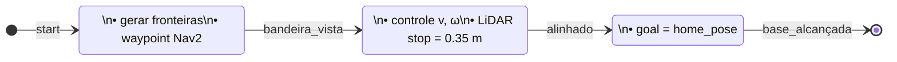

<!-- ===================================================================== -->
<!--                       README – Mission-ROS 2 🤖                         -->
<!-- ===================================================================== -->
# Sistema de Navegação & Controle da Missão com ROS 2 🤖

Projeto para o **Trabalho Avaliado 1 – Robôs Móveis**: um robô autônomo que explora o
ambiente, detecta uma bandeira e se posiciona para capturá-la, usando **ROS 2 Humble**.

<p align="center">
  
</p>

<div align="center">

[](https://www.ros.org/)
[](#como-compilar-e-rodar-)
[](LICENSE)

</div>

---

&nbsp;• [Estrutura](#estrutura-do-repositório-📂) • [Visão geral](#visão-geral-🗺️) • [Estratégia](#estratégia-🎯) • [Arquitetura & algoritmos](#arquitetura--algoritmos-⚙️) • [Resultados](#resultados-📊) • [Compilar e rodar](#compilar-e-rodar-🚀) • [Contribuição](#contribuição-🤝) • [Licença](#licença-📄) • [Membros](#membros-👥)

---

## Estrutura do repositório 📂

```bash
mission-ros2/
├── launch/                # Arquivos .launch.py
├── params/                # YAML de parâmetros
├── scripts/
│   ├── mission_manager.py # Máquina de estados global
│   └── flag_servo.py      # Servo-visão/LiDAR
├── urdf/                  # Modelo Xacro do robô
├── meshes/                # Recursos 3D
├── assets/                # GIFs & imagens usadas no README
├── package.xml
├── setup.py
└── README.md
```

---

## Visão geral 🗺️

| Módulo (scripts/)     | Responsabilidade                                                                                  | Tópicos ROS 2 principais                            |
|-----------------------|----------------------------------------------------------------------------------------------------|-----------------------------------------------------|
| **`mission_manager.py`** | Máquina de estados global (Explorar → Servo → Retorno). Gera metas ao Nav2, salva pose inicial. | `FollowWaypoints`, `/map`, `/odom`, TF              |
| **`flag_servo.py`**      | Servo-visão + LiDAR: alinhar e aproximar-se da bandeira. Publica conclusão à máquina de estados. | `/scan`, `/cmd_vel`, `/flag_servo_*`                |

<p align="center">
  
</p>

---

## Estratégia de navegação e controle 🎯



## Arquitetura & algoritmos ⚙️

### 1. Exploração por fronteiras

1. Constrói máscara **fronteira**: célula livre com vizinho desconhecido (dilatação 3 × 3).  
2. Descarta pontos a menos de **0 .2 m** dos obstáculos (transformada distância).  
3. Converte para coordenadas **`map`** e ignora as já visitadas (< 0 .5 m).  
4. Seleciona a **mais distante** do robô ⇒ cobertura ampla do terreno.  
5. Publica como *waypoint* único no servidor **Nav2 `FollowWaypoints`**; repete ao concluir.

### 2. Detecção da bandeira

* Gazebo exibe a label **BLUE_FLAG**.  
* `cv_bridge` → BGR → HSV ➜ faixa **`[86, 0, 6]–[94, 255, 255]`**.  
* Contornos com área > **1750 px** ⇒ `flag_found = True`; centróide fornece erro horizontal.

### 3. Servo-visão + LiDAR (`flag_servo.py`, 10 Hz)

| Variável         | Valor padrão | Função                                            |
|------------------|--------------|---------------------------------------------------|
| `v_max`          | 0 .20 m/s    | Velocidade linear inicial                         |
| `ω = –Kp · erro` | `Kp = 0.004` | Controle proporcional em pixels                  |
| `stop_distance`  | 0 .35 m      | Média dos 90° frontais do `/scan`                |
| `dead_zone`      | ±10 px       | Finaliza alinhamento                              |

### 4. Retorno à base

* Salva a primeira transformação **odom → map** como `home_pose`.  
* No estado **RETORNO**, publica `home_pose` como meta única para o Nav2.  
* A missão se encerra automaticamente quando o feedback do action retorna `SUCCEEDED`.

---

## Resultados 📊

| Métrica                           | Média ± DP        | Observação                                     |
|-----------------------------------|-------------------|-----------------------------------------------|
| Tempo até detectar a bandeira     | 47 s ± 6 s        | 10 execuções no mapa padrão                    |
| Tempo de servo-alinhamento        | 8.1 s ± 1.4 s     | Erro lateral < 3 cm, distância final ≈ 0 .33 m |
| Taxa de sucesso (missão completa) | **100 % (10/10)** | Inclui cenário com obstáculo extra             |

<p align="center">
  
</p>

---

## Como compilar e rodar 🚀

```bash
# 1. Clonar
mkdir -p ~/ros2_ws/src
cd ~/ros2_ws/src
git clone https://github.com/SEU_USUARIO/mission-ros2.git

# 2. Compilar
cd ~/ros2_ws
source /opt/ros/humble/setup.bash
rosdep install --from-paths src --ignore-src -r -y
colcon build --symlink-install
source install/setup.bash

# 3. Executar simulação
# Terminal A — mundo + robô
ros2 launch prm_gazebo world.launch.py

# Terminal B — Nav2 + missão
source ~/ros2_ws/install/setup.bash
ros2 launch mission_bringup mission.launch.py
```
