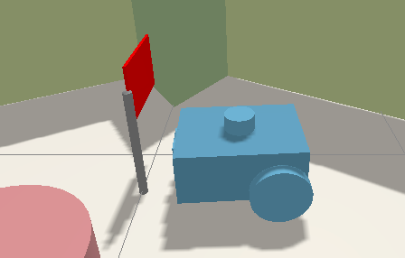
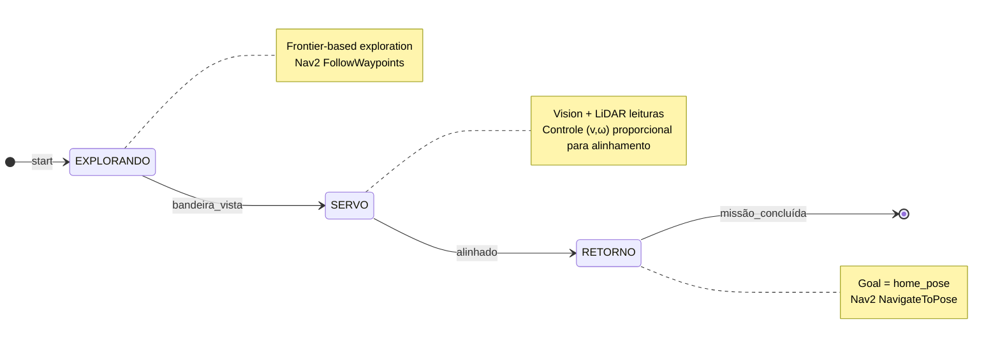
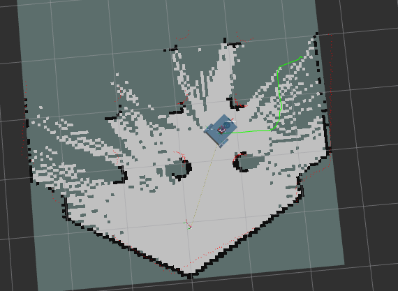
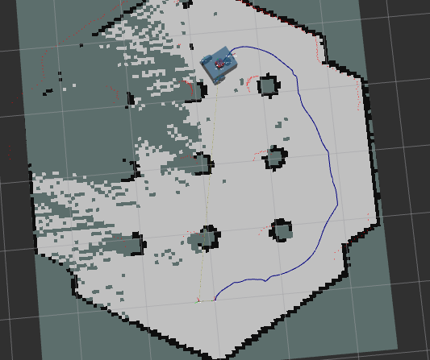

<!-- ===================================================================== -->
<!--                       README – Mission-ROS 2 🤖                         -->
<!-- ===================================================================== -->
# Sistema de Navegação & Controle da Missão com ROS 2 🤖

Projeto para o **Trabalho Avaliado 1 – Robôs Móveis**: um robô autônomo que explora o
ambiente, detecta uma bandeira e se posiciona para capturá-la, usando **ROS 2 Humble**.

<p align="center">
  
</p>

<div align="center">

[](https://www.ros.org/)
[](#como-compilar-e-rodar-)
[](LICENSE)

</div>

---
<div align="center">

• [Estrutura](#estrutura-do-repositório-📂)
• [Visão Geral](#visão-geral-🗺️)
• [Estratégia](#estratégia-adotada🎯)
• [Pacotes ROS 2](#pacotes-ros-2-utilizados)
• [Arquitetura & Algoritmos](#arquitetura--algoritmos-⚙️)
• [Compilar e Rodar](#como-compilar-e-rodar-🚀)
• [Contribuição](#contribuição-🤝)
• [Licença](#licença-📄)
• [Membros](#membros-👥)

</div>

---

## Estrutura do repositório 📂

```bash
mission-ros2/
├── config/
├── description/           # Modelo Xacro do robô
├── launch/                # Arquivos .launch.py
│   ├── launch_integrado.launch.py #Arquivo de incicialização da simulação e dos pacotes de mapeamento e navegação.
├── models/
├── prm/
│   ├── mission_manager.py # Máquina de estados global
│   └── flag_servo.py      # Servo-visão/LiDAR
├── resource/                # Recursos 3D
├── rviz/
├── test/
├── world/
├── images/                
├── package.xml            # Imagens para o README
├── setup.py
└── README.md
```

---

## Visão geral 🗺️

| Componente (pasta/arquivo) | Tipo | Responsabilidade principal | Tópicos / recursos ROS 2 usados |
|-----------------------------|------|----------------------------|---------------------------------|
| **`prm/mission_manager.py`** | Nó Python | Máquina de estados global (Explorar → Econtra Bandeira → Flag_servo (aproximação) → Retorno à base). Salva pose inicial, gera metas ao Nav2 para exploração do mapa, chama flag_servo ao encontrar a bandeira, escuta `/flag_servo_arrived` para voltar à base. | `nav2_msgs/action/FollowWaypoints`, `geometry_msgs/PoseStamped`, `tf2_ros`, `/map`, `/odom` |
| **`scripts/flag_servo.py`** | Nó Python | Câmera Segmentada + LiDAR: alinha e aproxima-se da bandeira, publica conclusão. | `/robot_cam/colored_map`, `sensor_msgs/LaserScan`, `/cmd_vel`, `/flag_servo_enable`, `/flag_servo_arrived` |
| **`launch/launch_integrado.launch.py`** | Launch file | Sobe SLAM Toolbox, Nav2 stack, launch `inicializa_simulcao.launch.py` e `carrega_robo.launch.py`. | `ros2 launch` |
| *`description/robot.urdf.xacro`** | Modelo | Robô diferencial com câmera, LiDAR e IMU; frames TF corretos. | `robot_state_publisher`, `gazebo_ros_pkgs` |

---

## Pacotes ROS 2 utilizados

| Categoria                     | Pacote / ferramenta                                         | Função na solução                                                                         |
|-------------------------------|-------------------------------------------------------------|-------------------------------------------------------------------------------------------|
| **Localização & Mapeamento**  | `slam_toolbox`                                              | SLAM síncrono 2 D; publica `/map` e TF `map ↔ odom`                                       |
| **Navegação**                 | `nav2_bt_navigator`, `nav2_controller`, `nav2_planner`      | Planejamento global (A*) e controle local (DWB)                                           |
| **Visão**                     | `image_transport`, `cv_bridge`, `sensor_msgs`              | Converte frame da câmera do Gazebo → OpenCV para segmentar a bandeira                     |
| **Comunicação**               | `rclpy`, `tf2_ros`                                          | Nó Python e transformações de quadros                                                    |
| **Simulação**                 | `gazebo_ros`, `prm_gazebo`                                  | Carrega o mundo base, sensores de câmera e LiDAR                                          |


---

## Estratégia Adotada🎯
### Visão de Alto Nível



---

## Estratégia detalhada

### 0. Utilização do SLAM toolbox
Considerando a proposta apresentada pelo trabalho de permitir uma navegação universal em ambientes desconhecidos, a ideia inicial foi adotar o uso do SLAM (Simultanious Localization and Mapping), de forma a permitir que houvesse uma representação em ocuppancy grid do ambiente e facilitando a posterior navegação do robô pelo ambiente por meio de algorimos de planejamento de trajetória. Para isso, foi utilizado o pacote do Slam_ToolBox, que oferece funcionalidades de mapeamento síncrono/assíncrono com otimização em tempo real.

### 1. Exploração guiada por fronteiras (`EXPLORANDO`)
Durante esta etapa, o principal objetivo é explorar o mapa em busca da bandeira, de forma autônoma e baseando-se em algoritmos de planejamento de trajetória. Para isso, utilizamos uma adaptação nossa do algoritmo *Incremental Frontier Exploration* implementado no **`mission_manager.py`**, cuja implementação é definida abaixo. O resultado é a exploração completa do mapa até encontrar a bandeira.

#### Lógica:

- A cada atualização do tópico `/map`, identificam-se as **fronteiras** entre regiões mapeadas e não mapeadas.
- Aplica-se um filtro de segurança que ignora pontos muito próximos de obstáculos.
- As células são classificadas da seguinte forma:
  - `-1`: células ainda não mapeadas
  - `0`: células livres
  - `100`: células ocupadas

#### Fluxo do Algoritmo:

1. Detectar pontos de fronteiras entre áreas conhecidas e desconhecidas.
2. Aplicar filtro de segurança baseado na distância a obstáculos.
3. Selecionar o ponto de fronteira **mais distante** do robô, de forma a garantir uma cobertura maior do mapa.
4. Enviar esse ponto ao *action server*: **Nav2 `FollowWaypoints`**


<p align="center">
  
</p>

### 2. Detecção robusta da bandeira (BANDEIRA DETECTADA)
Enquanto faz-se a exploração e o mapeamento por meio do algoritmo acima descrito, um callback do tópico da câmera de segmentação extrai a imagem e segmenta a região de interesse no espaço de cores HSV que corresponde à cor da bandeira **[(HSV_MIN = (86, 0, 6) HSV_MAX = (94, 255, 255)]**. O frame chega em BGR, é convertido para HSV com `cv_bridge` e recebe **threshold**. Então. uma heurística de área (> 1750 px) é aplicada para evitar falsos-positivos oriundos de ruídos, garantindo que a exploração pare quando a bandeira for encontrada e estiver suficientemente presente na imagem do robô


<p align="center">
  
</p>

### 3. Aproximação da bandeira (NAVIGANDO_PARA_BANDEIRA E POSICIONANDO_PARA_COLETA)
Esta parte da estratégia é controlada pelo nó `flag_servo`, que fica aguarando a publicação de "true" no tópico "/flag_servo_enable' para iniciar a busca da bandeira. O robô então extrai a imagem da bandeira segmentada da mesma forma que na estratégia anterior, calcula o centróide da bandeira na imagem e faz um controle proporcional para manter o alinhamento com a bandeira, enquanto verifica a distância dos feixes frontais do LIDAR.
Resumo do algoritmo:
Enquanto o contorno está presente:  
* **ω** proporcional ao erro do centróide (pixels).  
* **v** decrescente com a média dos 90 ° frontais do LiDAR (*range-keeper*).  
* Quando `|erro| < 10 px` **e** distância `< 0.35 m` → Entra num alinhamento final, para garantir que está completamente alinhado à bandeira.
* publica `/flag_servo_arrived`.

### 4. Retorno à base  
O primeiro TF `map → odom` capturado vira `home_pose` para voltar para a base. Após alinhamento, a máquina de estados envia esse `PoseStamped` ao **Nav2 NavigateToPose**; ao receber status **`SUCCEEDED`** a missão termina com o robô já na base.


<p align="center">
  
</p>

---

## Arquitetura & algoritmos ⚙️

### 1. Exploração por fronteiras
1. Matriz `occ_grid` proveniente do **`slam_toolbox`**.  
2. Máscara **fronteira** = célula **livre** com vizinho **desconhecido**.  
3. Filtro: distância > 0.2 m de obstáculos (**distance transform**).  
4. Conversão para o frame `map`; remove duplicatas (< 0.5 m).  
5. Seleciona a mais distante ⇒ envia ao action **`FollowWaypoints`**.

### 2. Detecção da bandeira (OpenCV)

```python
hsv  = cv.cvtColor(cv_img, cv.COLOR_BGR2HSV)
mask = cv.inRange(hsv, HSV_MIN, HSV_MAX)
cnts, _ = cv.findContours(mask, cv.RETR_EXTERNAL, cv.CHAIN_APPROX_SIMPLE)
```
### 3. Servo-visão + LiDAR (`flag_servo.py`)

| Constante       | Valor      | Função / Observação                      |
|-----------------|------------|------------------------------------------|
| `v_max`         | **0.20 m/s** | Velocidade linear inicial               |
| `Kp`            | **0.004**    | Ganho proporcional usado em ω (rad/s)   |
| `stop_distance` | **0.35 m**   | Distância alvo medida pelo LiDAR frontal|
| `dead_zone`     | **±10 px**   | Margem de erro aceitável no centróide   |

Ciclo de controle a cada 100 ms:

1. **Segmentação da bandeira** – obtém centróide e área do contorno ciano.  
2. **Cálculo de erro angular** – diferença horizontal entre centróide e centro da imagem.  
3. **Controle de rotação** – ω proporcional ao erro (ganho `Kp`).  
4. **Controle de avanço** – `v` reduz‐se gradualmente conforme a média dos 90 ° frontais do LiDAR indica aproximação ao alvo; jamais cai abaixo de 0.06 m/s até parar em `stop_distance`.  
5. **Condição de parada** – quando `|erro| < 10 px` **e** distância `< 0.35 m`, publica `/flag_servo_arrived`, sinalizando à máquina de estados que o robô está alinhado e posicionado.

### 4. Retorno à base

* A primeira transformação **`map → odom`** recebida é armazenada como `home_pose`.  
* No estado **RETORNO**, esse `PoseStamped` é enviado como meta única ao **Nav2 NavigateToPose**.  
* Ao receber o status **`SUCCEEDED`**, o nó `mission_manager` encerra a missão.

---

## Como compilar e rodar 🚀

```bash
# 1. Clonar
cd ~/ros2_ws/src
git clone https://github.com/Vinicius-GN/prm/

# 2. Compilar
cd ~/ros2_ws
source /opt/ros/humble/setup.bash
rosdep install --from-paths src --ignore-src -r -y
colcon build
source install/setup.sh

# 3. Executar simulação
# Terminal A — mundo + robô
ros2 launch prm launch_integrado.launch.py

# Terminal D — Lógica do Servo
source install/setup.sh
ros2 run prm flag_servo

# Terminal C — Nav2 + missão
source install/setup.sh
ros2 run prm mission_manager

#Nota: O launch demora por volta de 20 segundos para inicializar todos os pacotes. Dessa forma, aguarde um tempo antes de rodar os nós da missão.
= Ao rodar o script do mission manager, alguns warnings aparecem. Aguarde alguns segundos até estabilizar e a exploração ser iniciada.
# Qualquer dúvida ou erros encontrados, falar com os membros do grupo.

```

---

## Contribuição 🤝

Sugestões, *bug-reports* e **pull requests** são muito bem-vindos!  
Abra uma **Issue** para discutir melhorias ou envie o **PR** diretamente.

---

## Membros 👥

| Nome                  | Número USP | GitHub                                 |
|-----------------------|------------|----------------------------------------|
| Vinicius Gustierrez Neves      | 14749363   | [@Vinicius-GN](https://github.com/Vinicius-GN)|
| Beltrano Pereira      | 23456789   | [@beltrano](https://github.com/beltrano)|
| Ciclano Souza         | 34567890   | [@ciclano](https://github.com/ciclano)|

